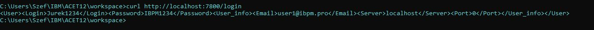
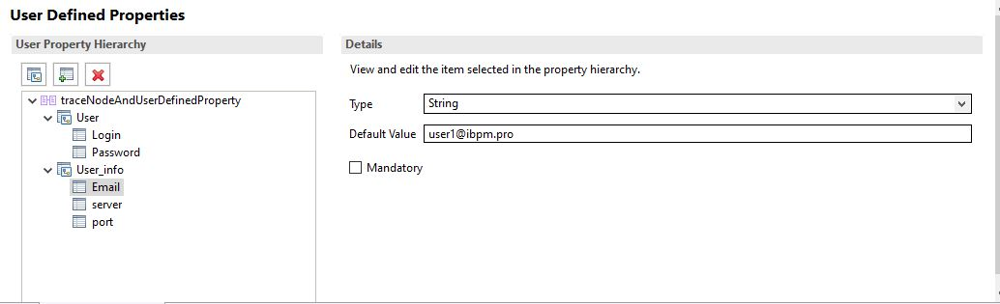

# Modelowanie Przeplywu
| TEAMTY ZAWARTE W PLIKU W REPOZYTORIUM | 
| ------ |
| **Obsługa błędów (terminale Failure, Catch, node TryCatch, node Throw)** |
| **Long-lived variables (SHARED)** | 
| **Wysyłanie danych w nagłówkach HTTP** |
| Wykorzystanie node Trace (do logowania) |

| TEAMTY ZAWARTE W README |
| ------ |
| [**User Defined Property**](#user-defined-property-udp) |
| [**Obsługa Integration Servera w konsoli (sprawdzanie listy serwerów, startowanie i stopowanie serwera, deployment bar, zmiana   propertisów w bar)**](#Obsługa-Integration-Servera-w-konsoli) |

| TEAMTY DO ZREALIZOWANIA |
| ------ |
| Promote Property |
| Operacje SELECT w ESQL |
| Callable Flows |
| Działanie parserów XMLNSC i JSON |

# Obsługa Integration Servera w konsoli

### **Polecenia wykorzystane przeze mnie w konsoli:**
  - **Utworzenie węzła ->** ``` mqsicreatebrokeR TEST_NODE```
  - **sprawdzanie węzła ->** ```mqsicvp TEST_NODE```
  - **Ustawienie portu administratora ->** ```mqsichangeproperties TEST_NODE -b webadmin -o HTTPConnector -n port -v 7602```
  - **Uruchomienie węzła ->**```mqsistart TEST_NODE```
  - **Wyświetlanie listy wszystkich węzłów ->**```mqsilist```
  - **Utworzenie serwer w węźle ->** ```mqsicreateexecutiongroup TEST_NODE  -e default -w 90```
  - **utworzenie pliku BAR. ->** ```mqsipackagebar -w C:\Users\Szef\IBM\ACET12\workspace -a mynewbarfile -k Praca_domowa_obsluga_bledow -y xsd_Lib```
  - **Deploy ->** ```mqsideploy -p 7602 -e default -a newTestFielBar.bar```
  - **Sprawdzanie włąsciwości BAR. ->** ```mqsireadbar [-b  | -r  | -v]``` 


[Początek Pliku -^](#Modelowanie-Przeplywu)

# User Defined Property (UDP)


