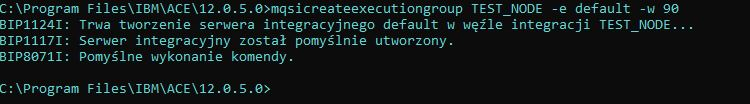
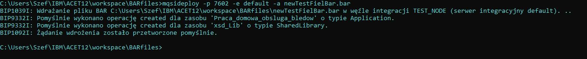

# Modelowanie Przeplywu

- [x] **Obsługa błędów (terminale Failure, Catch, node TryCatch, node Throw)**

- [x] **Long-lived variables (SHARED)**

>User Defined Property

>Promote Property

>Wykorzystanie node Trace (do logowania)

>Wysyłanie danych w nagłówkach HTTP

>Operacje SELECT w ESQL

>Callable Flows
   
- [x] **Obsługa Integration Servera w konsoli (sprawdzanie listy serwerów, startowanie i stopowanie serwera, deployment bar, zmiana   propertisów w bar)**

>Działanie parserów XMLNSC i JSON

# Obsługa Integration Servera w konsoli

### **Polecenia wykorzystane przeze mnie w konsoli:**
 - **Utworzenie węzła ->** mqsicreatebrokeR LOCAL_MB_NODE
  - **Ustawienie portu administratora ->**  mqsichangeproperties LOCAL_MB_NODE -b webadmin -o HTTPConnector -n port -v 7601
  - **Uruchomienie węzła ->**  mqsistart LOCAL_MB_NODE
  -  **Wyświetlanie listy wszystkich węzłów ->**  mqsilist
  - **Utworzenie serwer w węźle ->** mqsicreateexecutiongroup LOCAL_MB_NODE -e default -w 90
  -  **sprawdzanie węzła ->** mqsicvp LOCAL_MB_NODE
  -  **utworzenie pliku BAR. ->** mqsipackagebar -w C:\Users\Szef\IBM\ACET12\workspace -a mynewbarfile -y xsd_Lib
  - **Deploy ->** mqsideploy -p 7601 -e default -a C:\Users\Szef\IBM\ACET12\workspace\BARfiles\mynewbarfile.bar
  - **Sprawdzanie włąsciwości BAR. ->** mqsireadbar [-b  | -r  | -v] 

